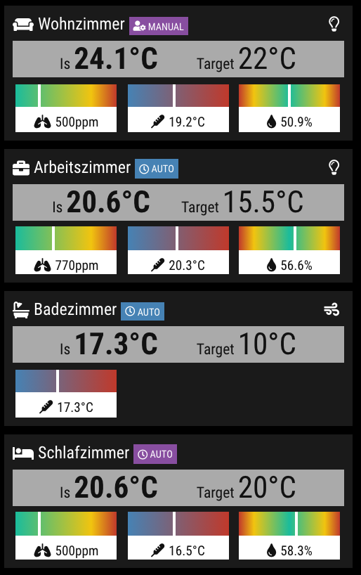

# MMM-BoschSmartHome

[](https://github.com/jalibu/MMM-BoschSmartHome/releases) [](https://snyk.io/test/github/jalibu/MMM-BoschSmartHome?targetFile=package.json)

A client interface for the Bosch Smart Home System on the [MagicMirror²](https://magicmirror.builders/) platform.  
Click here for the MagicMirror [Forum Thread](https://forum.magicmirror.builders/topic/14347/mmm-bsh-bosch-smart-home/).

**Note**: This module is a private and unofficial project without any relation to _Robert Bosch Smart Home GmbH_. I do not give any warranty, nor am I responsible for any damage.

Contribution welcome.

## Support

I put a lot of time and effort into the creation and maintenance for this module and I'm glad so many people like it.
If you also like this module and want to thank, please rate this repository with a star or donate a small amount [that is worth it to you](https://paypal.me/jalibu).

## Features

- Support for multiple rooms
- Door-/ Window Contacts
- Room Climate Controls
- Thermostats
- Twinguards
- Visualization of Temperature, Humidity and Purity
- Bosch Home Connect Dishwashers _(experimental!)_
- Philips Hue Bridge
- Languages: English, German, French _(feel free to contribute)_

## Screenshot



## Installing the Module

1. Navigate to the `MagicMirror/modules` directory and execute the following commands

   ```sh
   git clone https://github.com/jalibu/MMM-BoschSmartHome
   cd MMM-BoschSmartHome
   ```

2. Install dependencies with the following command

   ```sh
   npm install
   ```

3. Generate Certificate

   ```sh
   openssl req -x509 -nodes -days 9999 -newkey rsa:2048 -keyout client-key.pem -out client-cert.pem
   ```

   Important: Make sure, that you enter at least a valid country code (i.e. DE, FR, US, NL, ...). Otherwise it won't work.

4. Add the module configuration into the `MagicMirror/config/config.js` file (sample configuration):

   ```javascript
   {
     module: "MMM-BoschSmartHome",
     position: "top_left",
     config: {
       host: "192.168.0.150", // Bosch Smart Home Bridge's local IP Address
       name: "MMM-BoschSmartHome", // Display name for App
       identifier: "MMM-BoschSmartHome", // Unique Identifier for app
       password: "", // Password for Bosch Smart Home Bridge
       refreshIntervalInSeconds: 60, // Default: 60
       width: "340px",
       displayRoomIcons: false, // Default: false
       hideComponents: {}, // See example below. Default: {}
       hideEmptyRooms: false, // Hide rooms, if they have no information to display. Default: false
       colorizeRoomWithAirQuality: false, // Colorizes room tiles in red/orange/green depending on combined air quality. Only works with Twinguard
       roomOrder: [], // Manually set the room order by a list of room names, e.g. ["Livingroom", "Bedroom", "Kitchen"]
       airquality: {
         purity: "bar", // one of [tile, bar, donut, none]
         humidity: "bar", // one of [tile, bar, donut, none]
         temperature: "bar", // one of [tile, bar, donut, none]
         preferredTemperatureProvider: "Twinguard", // Twinguard or ClimateControl
         preferredHumidityProvider: "Twinguard" // Twinguard or ClimateControl
       },
       temperatureLevel: {
         displayCurrentTemperature: true, // Default: true
         displayTargetTemperature: true, // Default: true
         forceRowTile: true // Show tile as row, even if there is no target temperature. Default: true
       },
       thermostats: {
         display: false, // Default: true
         displayName: false // Default: false
       }
     }
   }
   ```

   You can hide individual components per room. Check sample for possible values:

   ```javascript
    config: {
      hideComponents: {
        "Livingroom": ["temperature", "purity", "humidity"],
        "Bed Room": ["battery", "climateControl", "temperatureLevel", "hue"],
        "Kitchen": ["shutters", "dishwasher", "thermostats"],
        "Dungeon": ["room"] // hides entire room
        }
    }
   ```

5. **Important**: When the module is started for the first time, a pairing between the MagicMirror and the Bosch Smart Home Bridge is automatically created with the generated certificate. For this to work, you must press the pairing button on the bridge for 5 seconds until it starts flashing. Then startup MagicMirror. This only has to be done once.

## Update

Just enter the module's directory, pull the update and install the dependencies:

```bash
cd ~/MagicMirror/modules/MMM-BoschSmartHome
git pull
npm install
```

## Contribution and Development

This module is written in TypeScript and compiled with Rollup.  
The source files are located in the `/src` folder.
Compile target files with `npm run build`.

Contribution for this module is welcome!

## Thanks to

- all testers and supporters.
- [holomekc](https://github.com/holomekc/bosch-smart-home-bridge) for your amazing BSHB connector, which is a basic component of this module.

## License

This project is licensed under the MIT License - see the [LICENSE](LICENSE.md) file for details.
